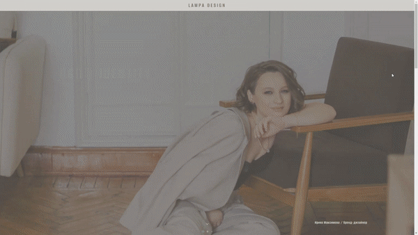

### Привет, меня зовут Диана!

<b>GitHub статистика</b>

<table>
  <tr>
    <td>
      
    </td>
    <td>
    	
    </td>
  </tr>
</table>
<table>
	<tr>
  		<td>
    		
    	</td>
		<td>
    		
    	</td>
	</tr>
</table>

<b>Мои проекты</b>

<table background="./assets/banner_dark.svg">
  <tr>
    <td width="396px">
      
        
    </td>
    <!-- <td>
    	
      <a href="https://github.com/Sweetleo30/lampa-design"> 
        
      </a>
    </td> -->
  </tr>
</table>

<a align="center" href="https://github.com/Sweetleo30/lampa-design">
  

      
  

</a>

 
 

    

 

